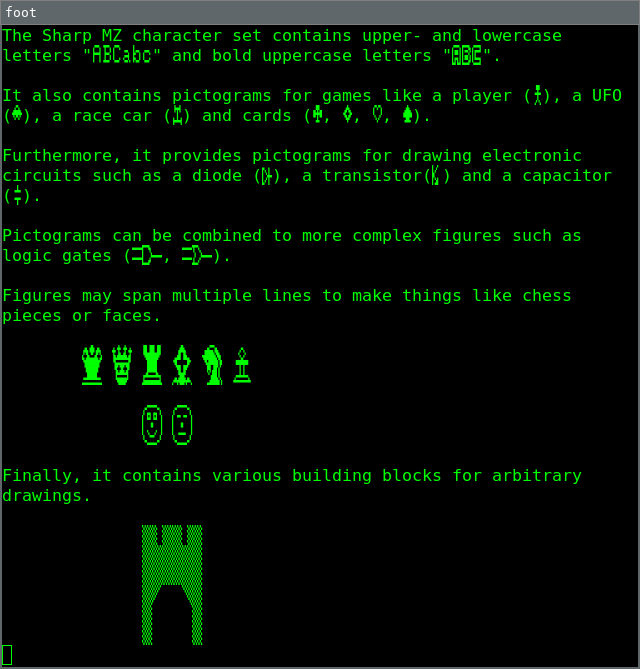
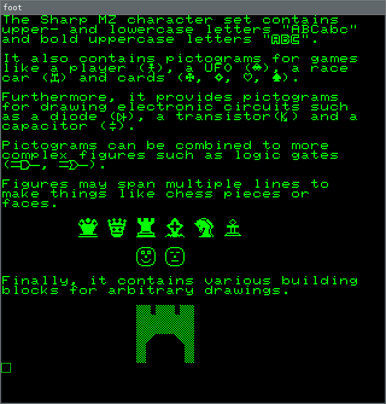

MzFont: Sharp MZ TrueType font generator
========================================

This package provides a way to generate and test several Sharp MZ TrueType
fonts.

Quick start
-----------

Download the Sharp MZ character and monitor ROMs_ and run the following
command.

.. code:: bash

    mzfont make mz700fon.int 1z-013a.rom ~/.local/share/fonts/SharpMZ.ttf
    fc-cache -fv ~/.local/share/fonts

Open a new terminal that uses the Sharp MZ font.

::

    foot -f SharpMZ

The `default` subcommand additionally changes the default font, uses square
characters and removes line spacing.

Please see ReadTheDocs_ for the latest documentation.

.. _ROMs: https://ia803204.us.archive.org/view_archive.php?archive=/29/items/mame-0.221-roms-merged/mz700.zip
.. _ReadTheDocs: https://mzfont.readthedocs.io
