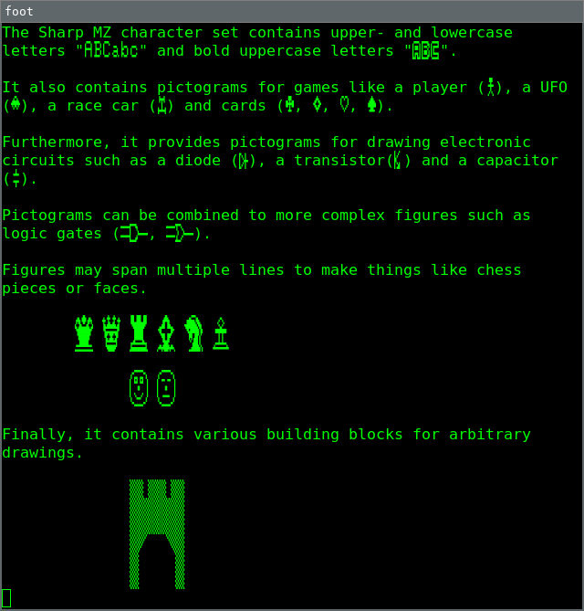
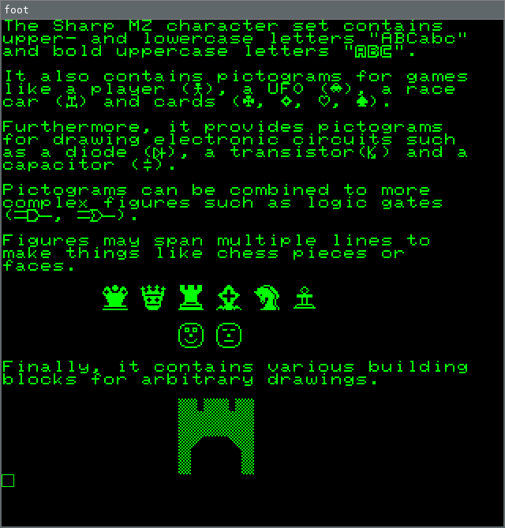
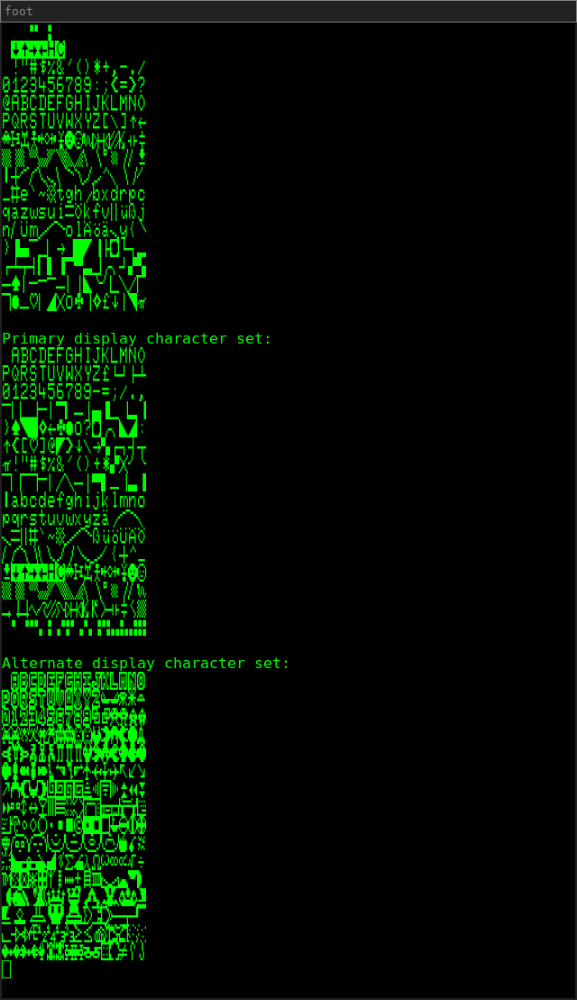
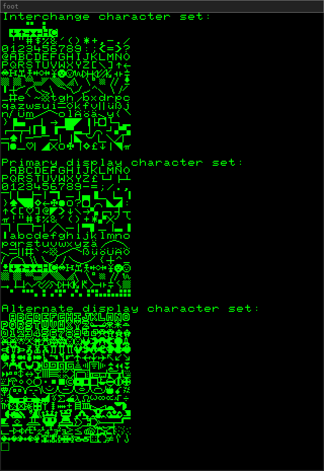

Usage
=====

This program uses the Sharp MZ character and monitor ROMs_ for the display
character sets and the interchange character set respectively.

`make`
------

The `make` subcommand creates a font that contains three character sets in the
UTF-8 Private Use Area. The interchange character set is stored at 0xe000, the
primary display character set is stored ad 0xe100 and the alternate display
character set is stored ad 0xe200. The default font is left unchanged.

.. code:: bash

    mzfont make mz700fon.int 1z-013a.rom ~/.local/share/fonts/SharpMZ.ttf
    fc-cache -fv ~/.local/share/fonts

Open a new terminal that uses the Sharp MZ font.

::

    foot -f SharpMZ

`default`
---------

The `default` subcommand additionally changes the default font, uses square
characters and removes line spacing.

.. code:: bash

    mzfont default mz700fon.int 1z-013a.rom ~/.local/share/fonts/SharpMZD.ttf
    fc-cache -fv ~/.local/share/fonts

Open a new terminal that uses the Sharp MZ default font.

::

    foot -f SharpMZD

`test`
------

The `test` subcommand shows all three character sets.

::

    mzfont test

If the `make` subcommand was used to create the font, the output should look as
follows.

If the `default` subcommand was used to create the font, the output should look
as follows.

.. _ROMs: https://ia803204.us.archive.org/view_archive.php?archive=/29/items/mame-0.221-roms-merged/mz700.zip
